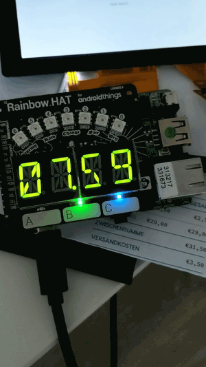

# toggl-things-tracker
Android Things app for tracking your workday via [Toggl](https://www.toggl.com/). Displays today's worked time and plays a well-known chime as well as switches on an LED after 8 hours to remind you to wrap things up.
If your board has a full-blown display attached it will show the currently tracked time entry there as well.



# Prerequisites

- Android Things compatible board (see https://developer.android.com/things/hardware/index.html: Raspberry Pi 3, NXP Pico i.MX7D, NXP Pico i.MX6UL) with developer preview 7
- optional (but strongly recommended, the code will run without, but you won't see anything. Consider using a Pimoroni Rainbow HAT.): 
    - buzzer
    - alphanumeric displays
    - LED
- really optional: display

# Setup

0. We'll assume you already have a Rainbow HAT assembled on the board of your choice and Android Things flashed. 
1. Add a `gradle.properties` file (if not yet existent after importing into Android Studio) to the root of the project and configure Toggl. You can use the following template:

```
# Project-wide Gradle settings.

# IDE (e.g. Android Studio) users:
# Gradle settings configured through the IDE *will override*
# any settings specified in this file.

# For more details on how to configure your build environment visit
# http://www.gradle.org/docs/current/userguide/build_environment.html

# Specifies the JVM arguments used for the daemon process.
# The setting is particularly useful for tweaking memory settings.
org.gradle.jvmargs=-Xmx1536m

# When configured, Gradle will run in incubating parallel mode.
# This option should only be used with decoupled projects. More details, visit
# http://www.gradle.org/docs/current/userguide/multi_project_builds.html#sec:decoupled_projects
# org.gradle.parallel=true

# Toggl data
togglToken=<insert toggl token here>
togglWorkspaceId=<insert toggl workspace ID here>
togglUserId=<insert toggl user ID here>
```

The Toggl data is used to retrieve your time entries for the current day.

2. Then install the APK onto the device (you might need to restart the device after first installation as permissions might not get picked up properly - this is a known bug on the Android Things platform).
3. The alphanumeric display shows the total amount tracked today (HH.MM). After 8 hours a chime will play via the buzzer and the LED will switch on to remind you to refuel your batteries. The currently tracked time entry as well as the total week time and the week total goal for the current day (fraction of the total work time which is 5*8 hours by default) will be shown on the display. Data is refreshed every minute.

# Tips for connecting the Pico to your host computer
- if you want to connect the Pico to a MacBook Pro with USB-C only connectors and you want to use a USB-A (Macboook Pro via adapter) to USB-C (Pico direct) connector cable: don't one of these a simple USB-A to USB-C adapter for connecting the cable to your Macbook. The Pico won't boot. Use the bulky 3-in-1 (HDMI, USB-C, USB-A) adapter instead as the others don't pull enough power to power the Pico. For me this was the only one to work.
- don't use USB-C as a power source and USB-A for adb, in most cases this won't work at all
